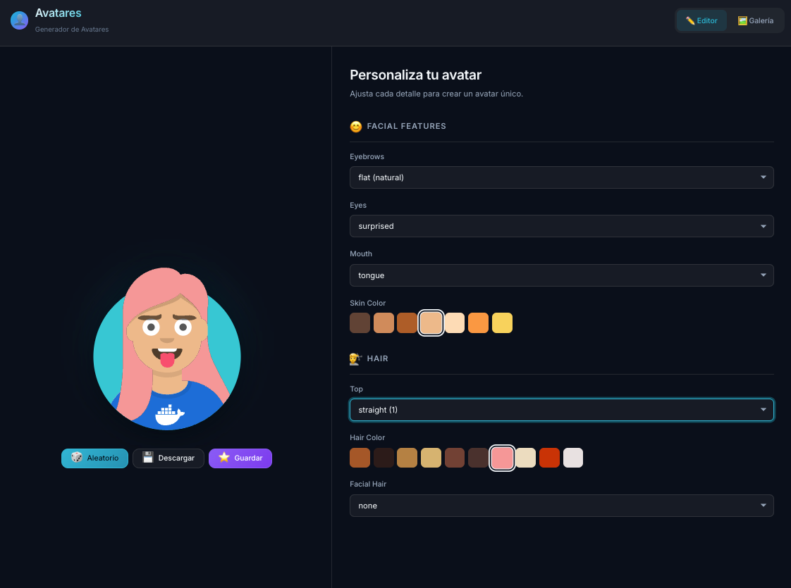
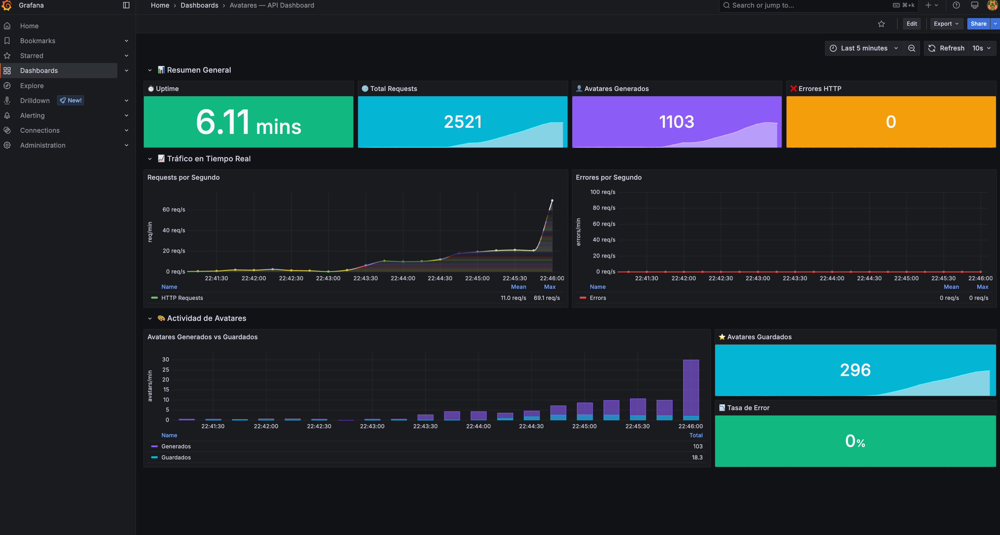
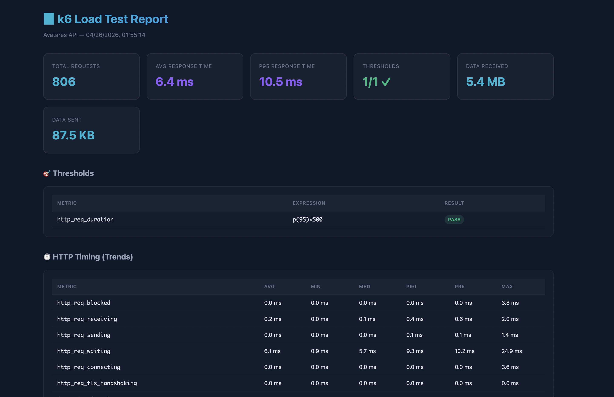

# 👤 Avatares — Generador de Avatares

Aplicación full-stack para generar y personalizar avatares SVG. Proyecto base para el curso de DevOps: incluye backend, frontend, contenedores, CI/CD, observabilidad y load testing. **El desafío de los estudiantes es llevar esta aplicación a Kubernetes.**



---

## Tabla de Contenidos

- [Arquitectura](#arquitectura)
- [Stack Tecnológico](#stack-tecnológico)
- [Inicio Rápido](#inicio-rápido)
- [Desarrollo Local](#desarrollo-local)
- [API Endpoints](#api-endpoints)
- [Funcionalidades](#funcionalidades)
- [Docker](#docker)
- [Tests](#tests)
- [Observabilidad](#observabilidad)
- [Load Testing](#load-testing)
- [Estructura del Proyecto](#estructura-del-proyecto)
- [Comandos Disponibles](#comandos-disponibles)
- [Desafío: Kubernetes y CI/CD](#desafío-kubernetes-y-cicd)

---

## Arquitectura

```
┌─────────────┐       ┌──────────────┐       ┌────────────┐
│   Browser   │──────▶│  Nginx (web) │──/api/▶│ Flask (api)│
│             │◀──────│  React SPA   │◀───────│ Gunicorn   │
└─────────────┘  :8080└──────────────┘        └─────┬──────┘
                                                    │
                                              ┌─────▼──────┐
                                              │   SQLite    │
                                              │  (gallery)  │
                                              └────────────┘
```

- **Web**: Nginx sirve el build estático de React y hace proxy reverso de `/api/*` al backend.
- **API**: Flask + Gunicorn genera avatares SVG con la librería `python-avatars` y persiste la galería en SQLite.
- **Red interna**: El API no se expone al host, solo es accesible desde el contenedor web a través de la red Docker.

---

## Stack Tecnológico

| Componente | Tecnología | Versión |
|-----------|-----------|---------|
| Frontend | React + Vite | 19.x / 6.x |
| Backend | Flask + Gunicorn | 3.x / 23.x |
| Avatares | python-avatars | 1.4.x |
| Base de datos | SQLite | 3.x |
| Contenedores | Docker + Compose | latest |
| Monitoreo | Prometheus + Grafana | 3.4 / 11.6 |
| Load Testing | k6 | 0.57 |
| Tests Backend | pytest | 8.x |
| Tests Frontend | Vitest + Testing Library | 3.x / 16.x |

---

## Inicio Rápido

### Prerrequisitos

- [Docker Desktop](https://www.docker.com/products/docker-desktop/) instalado y corriendo
- [Make](https://www.gnu.org/software/make/) (viene preinstalado en macOS y Linux)

### Levantar la aplicación

```bash
git clone <repo-url>
cd avatares-devops
make up
```

Abrir en el navegador: **http://localhost:8080**

### Verificar que todo funciona

```bash
make health     # Estado del API
make test-api   # Probar todos los endpoints
```

---

## Desarrollo Local

Si quieres desarrollar sin Docker, puedes correr cada servicio por separado.

### Backend (API)

```bash
cd api
python3 -m venv .venv
source .venv/bin/activate
pip install -r requirements.txt
python install_parts.py          # Instalar SVGs custom (solo la primera vez)
export FLASK_APP=app.py
export DB_PATH=./avatars.db
flask run                        # → http://localhost:5000
```

### Frontend (Web)

```bash
cd web
npm install
npm run dev                      # → http://localhost:5173
```

El servidor de desarrollo de Vite tiene un proxy configurado que redirige `/api/*` al backend en `http://localhost:5000`. Ambos servicios deben estar corriendo simultáneamente.

> **Variable de entorno opcional**: `VITE_API_URL` permite cambiar la URL del backend (por defecto `http://localhost:5000`).

---

## API Endpoints

| Método | Ruta | Descripción | Respuesta |
|--------|------|-------------|-----------|
| `GET` | `/api/avatar` | Renderizar avatar SVG | `image/svg+xml` |
| `GET` | `/api/avatar/spec` | Opciones de personalización | JSON con parts, groups, values |
| `GET` | `/api/gallery` | Listar avatares guardados (últimos 50) | JSON array |
| `POST` | `/api/gallery` | Guardar avatar en galería | JSON `{id, name, params, created_at}` |
| `DELETE` | `/api/gallery/:id` | Eliminar avatar de galería | 204 No Content |
| `GET` | `/health` | Estado del servicio + uptime | JSON `{status, service, uptime_seconds}` |
| `GET` | `/ready` | Readiness check para orquestadores | 204 No Content |
| `GET` | `/metrics` | Métricas en formato Prometheus | text/plain |

### Ejemplos

```bash
# Generar un avatar con ojos sorprendidos y boca sonriente
curl "http://localhost:8080/api/avatar?eyes=SURPRISED&mouth=SMILE" -o avatar.svg

# Ver opciones disponibles
curl http://localhost:8080/api/avatar/spec | python3 -m json.tool

# Guardar en galería
curl -X POST http://localhost:8080/api/gallery \
  -H "Content-Type: application/json" \
  -d '{"name": "Mi Avatar", "params": "eyes=DEFAULT&mouth=SMILE"}'

# Ver métricas
curl http://localhost:8080/metrics
```

---

## Funcionalidades

### Editor de Avatares
- Personalización de ojos, cejas, boca, pelo, barba y colores
- Botón **Aleatorio** 🎲 para generar combinaciones random
- Botón **Descargar** 💾 para exportar como SVG
- Vista previa en tiempo real con efecto glow animado

### Galería
- Guardar avatares con nombre
- Grid visual con cards y fechas
- Eliminar avatares guardados
- Persistencia en SQLite (sobrevive reinicios del contenedor gracias al volumen Docker)

### Navegación
- Tabs Editor / Galería en el header
- Toast notifications para feedback de acciones
- Footer con links directos a Health y Métricas
- Diseño responsive (desktop, tablet, mobile)

---

## Docker

### Arquitectura de contenedores

```yaml
services:
  api:    # Python 3.12 + Gunicorn (2 workers)
  web:    # Node 22 (build) → Nginx (producción)
```

- **API Dockerfile**: imagen `python:3.12-slim`, instala dependencias, pre-instala SVGs custom en build time, corre como usuario no-root.
- **Web Dockerfile**: multi-stage build — Node 22 Alpine para `npm ci && npm run build`, luego Nginx Alpine para servir los estáticos.
- **Nginx**: sirve el SPA, proxy reverso `/api/*` al backend, gzip habilitado, cache de assets.

### Volúmenes

| Volumen | Uso |
|---------|-----|
| `api-data` | Base de datos SQLite de la galería (`/data/avatars.db`) |

### Red

Los servicios se comunican a través de la red `avatars-net`. El API solo usa `expose` (no `ports`), así que no es accesible desde el host directamente — solo a través de Nginx.

### Comandos Docker

```bash
make up        # Construir y levantar
make down      # Detener
make restart   # Reiniciar
make logs      # Ver logs de todos los servicios
make logs-api  # Ver logs solo del API
make clean     # Eliminar todo (contenedores, imágenes, volúmenes)
```

---

## Tests

### Backend — pytest (24 tests)

```bash
make test-backend
```

| Archivo | Tests | Cobertura |
|---------|-------|-----------|
| `test_avatar.py` | 10 | Render SVG, params válidos/inválidos, colores, spec completo |
| `test_gallery.py` | 10 | CRUD galería, validaciones, orden, truncado de nombres |
| `test_health.py` | 4 | `/ready`, `/health`, `/metrics`, contadores |

### Frontend — Vitest + Testing Library (20 tests)

```bash
make test-frontend
```

| Archivo | Tests | Cobertura |
|---------|-------|-----------|
| `App.test.jsx` | 9 | Loading, error, editor, header, botones, tabs, footer, avatar |
| `Parts.test.jsx` | 6 | Render, grupos, selectores, color swatches, onChange |
| `Gallery.test.jsx` | 5 | Loading, vacío, render items, src correcto, error handling |

### Ejecutar todos

```bash
make test
```

---

## Observabilidad

La aplicación expone un endpoint `/metrics` compatible con Prometheus con las siguientes métricas:

| Métrica | Tipo | Descripción |
|---------|------|-------------|
| `avatars_generated_total` | counter | Total de avatares renderizados |
| `avatars_saved_total` | counter | Total de avatares guardados en galería |
| `http_requests_total` | counter | Total de requests HTTP |
| `http_errors_total` | counter | Total de errores HTTP |
| `uptime_seconds` | gauge | Segundos desde el inicio del proceso |

### Levantar Prometheus + Grafana

```bash
make monitoring
```

| Servicio | URL | Credenciales |
|----------|-----|-------------|
| Aplicación | http://localhost:8080 | — |
| Prometheus | http://localhost:9090 | — |
| Grafana | http://localhost:3000 | admin / admin |

### Dashboard de Grafana

El dashboard **"Avatares — API Dashboard"** se carga automáticamente (auto-provisioning) con:

- **Resumen**: uptime, total requests, avatares generados, errores
- **Tráfico en tiempo real**: requests/s y errores/s (gráficos de línea)
- **Actividad de avatares**: generados vs guardados, tasa de error



> Los archivos de provisioning están en `monitoring/grafana/`. Prometheus scrapea `/metrics` cada 15 segundos.

### Detener monitoreo

```bash
docker compose -f docker-compose.yml -f monitoring/docker-compose.monitoring.yml down
```

---

## Load Testing

Load tests con [k6](https://k6.io/) para generar tráfico y ver las métricas en acción.

### Test rápido (30 segundos)

```bash
make load-quick
```

Sube a 10 usuarios virtuales que generan avatares y consultan health.

### Test completo (2 minutos)

```bash
make load-full
```

Ejecuta 3 escenarios simultáneos:

| Escenario | Usuarios | Qué hace |
|-----------|----------|----------|
| `browse` | 5 constantes | Consulta spec y health |
| `generate` | 0 → 20 → 0 (rampa) | Genera avatares aleatorios |
| `gallery` | 5 req/s | Save + list + delete en galería |

### Thresholds automáticos

- p95 latencia < 500ms
- p99 latencia < 1000ms
- Tasa de error < 5%

### Reportes HTML

Al finalizar cada test se genera un reporte HTML en `loadtest/reports/` que se abre automáticamente en el navegador. Incluye:

- Cards de resumen (requests, latencia, thresholds)
- Tabla de thresholds con PASS/FAIL
- Detalle de timing por métrica (avg, min, med, p90, p95, max)
- Counters y rates



> **Tip**: Levanta el monitoreo (`make monitoring`) antes de correr los load tests para ver las métricas en tiempo real en Grafana.

---

## Estructura del Proyecto

```
avatares-devops/
├── api/                          # Backend Python
│   ├── Dockerfile                # Python 3.12 slim + Gunicorn
│   ├── app.py                    # Aplicación Flask (avatar, gallery, metrics)
│   ├── install_parts.py          # Pre-instalación de SVGs custom
│   ├── requirements.txt          # Dependencias de producción
│   ├── requirements-test.txt     # Dependencias de test (pytest)
│   ├── docker_shirt.svg          # SVG custom: camiseta Docker
│   ├── tilt_shirt.svg            # SVG custom: camiseta Tilt
│   └── tests/                    # Tests unitarios
│       ├── conftest.py
│       ├── test_avatar.py
│       ├── test_gallery.py
│       └── test_health.py
│
├── web/                          # Frontend React
│   ├── Dockerfile                # Multi-stage: Node 22 → Nginx
│   ├── nginx.conf                # Proxy reverso + SPA fallback
│   ├── package.json
│   ├── vite.config.js            # Vite + Vitest config
│   ├── index.html
│   └── src/
│       ├── App.jsx               # Componente principal (editor + galería)
│       ├── Parts.jsx             # Editor de partes del avatar
│       ├── Gallery.jsx           # Galería de avatares guardados
│       ├── App.css               # Estilos (tema oscuro, glassmorphism)
│       ├── index.css             # Variables CSS globales
│       ├── App.test.jsx          # Tests del App
│       ├── Parts.test.jsx        # Tests del editor
│       └── Gallery.test.jsx      # Tests de la galería
│
├── monitoring/                   # Observabilidad
│   ├── prometheus.yml            # Config de scraping
│   ├── docker-compose.monitoring.yml
│   └── grafana/
│       ├── dashboards/
│       │   └── avatars.json      # Dashboard auto-provisionado
│       └── provisioning/
│           ├── datasources/
│           │   └── prometheus.yml
│           └── dashboards/
│               └── dashboards.yml
│
├── loadtest/                     # Load testing con k6
│   ├── quick.js                  # Test rápido (30s)
│   ├── script.js                 # Test completo (2min, 3 escenarios)
│   ├── report.js                 # Generador de reportes HTML
│   └── reports/                  # Reportes generados (gitignored)
│
├── docker-compose.yml            # Servicios principales (api + web)
├── docker-compose.k6.yml         # Load testing con k6
├── Makefile                      # Comandos automatizados
└── README.md
```

---

## Comandos Disponibles

```bash
make help
```

| Comando | Descripción |
|---------|-------------|
| `make up` | Construir y levantar todos los servicios |
| `make down` | Detener todos los servicios |
| `make restart` | Reiniciar todos los servicios |
| `make logs` | Ver logs en tiempo real |
| `make logs-api` | Ver logs solo del API |
| `make logs-web` | Ver logs solo del frontend |
| `make build` | Construir imágenes sin levantar |
| `make clean` | Eliminar contenedores, imágenes y volúmenes |
| `make test` | Ejecutar todos los tests (backend + frontend) |
| `make test-backend` | Tests unitarios del backend (pytest) |
| `make test-frontend` | Tests unitarios del frontend (vitest) |
| `make test-api` | Probar endpoints del API (requiere servicios corriendo) |
| `make health` | Verificar estado del API |
| `make metrics` | Ver métricas Prometheus |
| `make monitoring` | Levantar Prometheus + Grafana |
| `make load-quick` | Load test rápido (30s, 10 usuarios) |
| `make load-full` | Load test completo (2min, 20 usuarios pico) |

---

## Desafío: Kubernetes y CI/CD

> **Este es el objetivo principal del proyecto.** Todo lo anterior es la base que ya funciona en Docker. El desafío es implementar las prácticas DevOps para llevar esta aplicación a producción.

### 1. CI/CD Pipeline

Crear un pipeline de integración y despliegue continuo usando **GitHub Actions**, **GitLab CI**, o **Jenkins**:

- Ejecutar los tests unitarios (backend y frontend) en cada push
- Construir las imágenes Docker
- Subir las imágenes a un registry (Docker Hub, GHCR, ECR)
- Desplegar automáticamente a staging/producción

> **Pista**: los comandos `make test-backend`, `make test-frontend` y `make build` ya están listos para usar en un pipeline. El endpoint `make test-api` sirve como smoke test post-deploy.

### 2. Kubernetes

Crear los manifests necesarios para desplegar la aplicación en un clúster:

- **Deployments** para `api` y `web`
- **Services** para comunicación interna
- **Ingress** para exponer la aplicación
- **PersistentVolumeClaim** para la base de datos SQLite
- **ConfigMaps** y/o **Secrets** para variables de entorno

### 3. Observabilidad en el clúster

- Desplegar Prometheus y Grafana en Kubernetes
- Configurar el scraping de `/metrics` usando annotations
- Importar el dashboard de Grafana incluido en `monitoring/grafana/dashboards/`

### 4. Infraestructura como Código (bonus)

- Usar **Terraform** para provisionar la infraestructura (VPC, clúster, etc.)
- Usar **Helm** para empaquetar los manifests de Kubernetes

### Pistas técnicas

- El servicio `web` (Nginx) necesita resolver el nombre `api` para el proxy reverso. En Kubernetes, esto se logra con un Service de tipo ClusterIP llamado `api`.
- El API necesita un volumen persistente para SQLite. Considerar si SQLite es adecuado para múltiples réplicas (spoiler: no lo es — investigar alternativas).
- Los endpoints `/ready` y `/health` ya están implementados y listos para usar como `readinessProbe` y `livenessProbe`.
- El endpoint `/metrics` está listo para ser scrapeado por Prometheus.
- Las imágenes Docker ya están optimizadas para producción (multi-stage, usuario no-root, health checks).

### Herramientas sugeridas

- **Minikube** / **k3s** / **Kind** para clúster local
- **kubectl** para gestión del clúster
- **GitHub Actions** / **GitLab CI** / **Jenkins** para CI/CD
- **Helm** para empaquetar manifests
- **Terraform** para provisionar infraestructura en la nube

---

## Más Información

Ver [ABOUT.md](./ABOUT.md) para instrucciones adicionales sobre cada componente.
